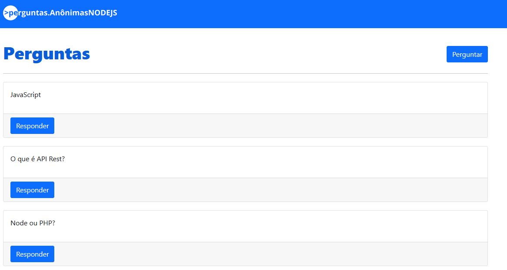

# Plataforma de Perguntas e Respostas



Este é um projeto de uma plataforma de perguntas e respostas desenvolvida com Node.js, Express, Sequelize e MySQL.

## Tecnologias Utilizadas
- **Node.js**: Ambiente de execução para JavaScript no servidor
- **Express**: Framework para criar aplicações web
- **EJS**: Template engine para renderização dinâmica
- **MySQL**: Banco de dados relacional
- **Sequelize**: ORM para interação com o banco de dados
- **Body-Parser**: Middleware para lidar com requisições HTTP

## Instalação
1. Clone o repositório:
   ```bash
   git clone https://github.com/seu-usuario/guiperguntas.git
   cd guiperguntas
   ```
2. Instale as dependências:
   ```bash
   npm install
   ```
3. Configure o banco de dados no arquivo `database/database.js`.

## Como Rodar o Projeto
1. Inicie o servidor:
   ```bash
   node index.js
   ```
   ou, para desenvolvimento com nodemon:
   ```bash
   npx nodemon index.js
   ```
2. Acesse no navegador:
   ```
   http://localhost:8080
   ```

## Funcionalidades
- Listagem de perguntas na página inicial
- Cadastro de novas perguntas
- Visualização de perguntas individuais com respostas
- Cadastro de respostas para perguntas

## Estrutura do Projeto
```
/guiperguntas
├── /database          # Configuração do banco de dados
├── /model            # Modelos Sequelize (Pergunta e Resposta)
├── /public           # Arquivos estáticos (CSS, JS, imagens)
├── /views            # Páginas renderizadas pelo EJS
├── index.js          # Arquivo principal do servidor
├── package.json      # Configuração do projeto
└── README.md         # Documentação
```

## Contribuição
Se quiser contribuir, fique à vontade para abrir um pull request ou relatar problemas na aba de issues.

## Autor
- **Marcos Eduardo**

## Licença
Este projeto está licenciado sob a licença ISC.